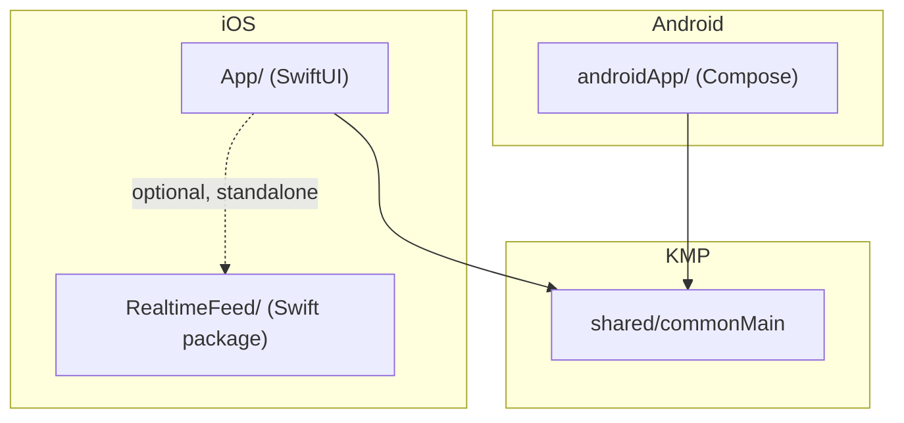

# web3demo

[](https://github.com/em1racle/web3demo/actions/workflows/ci.yml)

Realtime market data (Binance) and a minimal read-only dApp flow (WalletConnect + ERC-20 + NFT,
Sepolia testnet), shared between a native iOS app and a native Android app via Kotlin
Multiplatform — plus a hardware-backed wallet signing screen on each platform, unrelated to the
dApp flow. Built to check whether "shared business logic, native UI per platform" actually holds
up in practice, and to prove out the specific engineering risks a realtime + Web3 app actually
has (reconnect/backpressure, sequence-gap recovery, session lifecycle, exact-integer token math)
— not to ship a production wallet in a weekend.

There's also a standalone Swift package (`RealtimeFeed/`) that does the realtime logic with zero
Kotlin involved, kept around as a second reference implementation.

## Capabilities

- Live Binance trade + order-book streams, reconnecting with backoff and recovering from sequence
  gaps, shared between platforms.
- Hardware-backed signing key (Secure Enclave / Keystore+StrongBox), biometric-gated, native per
  platform — a different JD requirement than the dApp flow below, not related to it.
- Connect an external wallet via WalletConnect (Reown AppKit) on Sepolia. Read-only: this app
  never holds a private key capable of moving on-chain funds.
- Read a real ERC-20 balance (Chainlink's Sepolia LINK) via a public RPC endpoint, with exact
  integer arithmetic — no `Double` anywhere near a token amount.
- Read ERC-721 metadata (`ownerOf`/`tokenURI`), resolve `ipfs://` through a gateway, reject unsafe
  URI schemes.

## Module map



```
RealtimeFeed/   Swift package — WebSocket client, reconnect/backpressure, no KMP
shared/         KMP module (JVM + Android + iOS): realtime clients, RPC/ABI codec,
                token/NFT repositories, reconnect/gap-detection/token-refresh policies
App/            iOS app (SwiftUI) — Swift/KMP/Wallet/Portfolio tabs
androidApp/     Android app (Compose) — Prices/Wallet/Portfolio tabs
docs/           architecture.md, adr/, testing.md, ci.md, review.md, refactoring-report.md
```

See `docs/architecture.md` for the dependency rule, error model, and security assumptions in
full, and `docs/adr/` for the reasoning behind the four biggest structural decisions.

## Quick start

Requires: JDK 17, Xcode with a full iOS SDK (not just Command Line Tools), Android SDK at
`local.properties` (`sdk.dir=...`), [XcodeGen](https://github.com/yonaskolb/XcodeGen).

```bash
# shared logic — build + unit tests, no network, no simulator/emulator needed
./gradlew :shared:jvmTest

# Android app
./gradlew :androidApp:assembleDebug

# iOS app
./gradlew :shared:assembleSharedDebugXCFramework
cd App && xcodegen generate
xcodebuild -project Web3Demo.xcodeproj -scheme Web3Demo \
  -destination 'platform=iOS Simulator,name=iPhone 17' build
```

`App/Web3Demo.xcodeproj` is generated, not checked in — rerun `xcodegen generate` after pulling if
`project.yml` changed.

### Sepolia / WalletConnect setup

The ERC-20/NFT reads use a public, unauthenticated RPC endpoint
(`ethereum-sepolia-rpc.publicnode.com`) — no account needed. WalletConnect does need a free
project ID from [cloud.reown.com](https://cloud.reown.com); both apps currently point at the same
one, hardcoded in `Web3DemoApplication.kt` (Android) and `Web3DemoApp.swift` (iOS) — fine for a
demo, would move to a build config / secret for anything real.

## Demo flow

See `docs/demo-script.md` for the full walkthrough. Short version: Prices tab (live reconnect) →
Wallet tab (generate a hardware-backed key, sign, watch the OS biometric gate actually fire) →
Portfolio tab (connect an external wallet via WalletConnect, read its real Sepolia LINK balance).

## Security model

- No seed phrases or private keys for on-chain assets ever touch this app — WalletConnect
  authorizes an *external* wallet to sign; this app only sees public addresses and signatures it
  didn't produce.
- The Wallet tab's hardware-backed key is a separate, unrelated mechanism (device-bound signing
  demo, JD requirement #4) — it never signs anything on-chain and the two "wallet" concepts are
  intentionally not connected.
- Full write-up, including what is/isn't protected on a jailbroken/rooted device, in
  `docs/architecture.md`.

## What's tested where

Pure logic — reconnect timing, order-book sequence gaps, token-refresh timing, ABI encode/decode,
decimal formatting, IPFS URI normalization — is kept separate from the actual socket/HTTP/SDK code
specifically so it's unit-testable without a network. Live integration tests hit the real Binance
and Sepolia APIs; UI tests drive real taps, including a real WalletConnect modal presenting on
both platforms. Full breakdown in `docs/testing.md`.

## CI

One pipeline (`.github/workflows/ci.yml`): lint (ktlint + SwiftLint) → Android build/test →
iOS build/test, each gated on the previous. See `docs/ci.md` for why it's sequential rather than
parallel. It doesn't sign, publish, or report crashes; `RELEASE.md` covers what that would take
and why it isn't wired up here (needs accounts this repo doesn't have access to).

## Decision log

- [ADR-001](docs/adr/ADR-001-use-kotlin-multiplatform.md) — Kotlin Multiplatform for shared logic
- [ADR-002](docs/adr/ADR-002-use-repository-boundary.md) — repository boundary in front of RPC/SDK types
- [ADR-003](docs/adr/ADR-003-use-walletconnect-external-wallet.md) — WalletConnect over an in-app custodial key
- [ADR-004](docs/adr/ADR-004-use-mvvm-unidirectional-state.md) — MVVM, not a heavier state framework

## Roadmap

- [x] Realtime price feed with reconnect + backpressure
- [x] Order book with sequence-gap recovery
- [x] Hardware-backed wallet key (Secure Enclave / Keystore)
- [x] WalletConnect (Reown AppKit) — connect, session state, request plumbing, Sepolia only
- [x] ERC-20 balance read (exact integer math)
- [x] ERC-721 metadata read + IPFS resolution
- [ ] Transaction *preview* UI before a WalletConnect `eth_sendTransaction` request
- [ ] NFT gallery grid (currently: repository + tests, no dedicated screen)
- [ ] Token/transaction history
- [ ] Push notifications
- [ ] Signed release builds, crash reporting, phased rollout (see `RELEASE.md`)

## A few design decisions worth knowing before reading the code

- **`PriceFeedController` exists only for Swift.** Kotlin `StateFlow` doesn't bridge to Swift's
  `AsyncSequence` without an extra library (SKIE / KMP-NativeCoroutines), so there's a thin
  callback-based wrapper around the Flow-based client just for the iOS side. Android talks to the
  Flow-based client directly.
- **`KeyValueStore` and `WalletGateway` are plain interfaces, not `expect`/`actual`.** Android's
  `KeyValueStore` needs a `Context` in its constructor; iOS's doesn't need anything —
  `expect`/`actual` requires matching constructors across platforms, so a plain interface (which
  exports as a real Swift protocol) fits better. `WalletGateway` isn't even shared as a Kotlin
  type at all — see the next point.
- **Wallet-adjacent code (Secure Enclave/Keystore *and* WalletConnect) is not shared.** Both are
  deliberately platform-native. The signing-key code lives in
  `App/Sources/WalletKeyStore.swift` / `androidApp/.../WalletKeyStore.kt`. WalletConnect
  integration (`ReownWalletGateway` on each platform) mirrors the same *design* on both platforms
  but isn't literally the same Kotlin type — Reown ships genuinely different SDKs per platform,
  and the Android one's session state would need to cross into a real Kotlin `StateFlow` from
  Swift to be shared, which is real work with no payoff here.
- **Order book uses the raw `@depth` stream, not `@depth@100ms`.** The throttled variant would
  hide the backpressure problem it's meant to demonstrate.
- **Subscriptions go in the WebSocket URL, not a control frame.** Sending a control frame right
  after `resume()` races the handshake on `URLSessionWebSocketTask`. Binance supports encoding
  subscriptions directly in the connection URL, which sidesteps the race and makes
  resubscribe-on-reconnect trivial (reconnecting to the same URL just is resubscribing).
- **ABI encoding hardcodes standard 4-byte function selectors** (`balanceOf`, `ownerOf`, etc.)
  rather than computing them via Keccak256 at runtime — they're fixed by the ERC-20/ERC-721
  standards, so there's nothing to compute, and it avoids pulling in a Keccak implementation for
  the (very small) set of calls this app actually makes.
- **`uint256` values use a real BigInteger** (`com.ionspin.kotlin:bignum`), not `Long`. Raw
  ERC-20/NFT amounts routinely exceed `Long`'s range; a library is the right call for arbitrary
  precision arithmetic, not something to hand-roll.

## Known gaps

- The Wallet tab's key signs an arbitrary message, not a real transaction — no address derivation
  from the public key, no RLP-encoded transaction, and the curve (P-256) isn't the one BTC/ETH
  actually use (secp256k1). It demonstrates hardware-backed credential custody, not a wallet. See
  the comments in `WalletKeyStore` for what a real implementation would need to change.
- No indexer, so there's no "show me everything this wallet owns" — NFT reads are pinned to a
  specific, pre-configured contract/token-id, which is a real, documented limitation of ERC-721
  (see `docs/architecture.md`'s out-of-scope section), not an oversight.
- `docs/review.md` has the full, evidence-based list of what a staff-level pass found, ranked by
  severity, plus which findings were actually fixed (`docs/refactoring-report.md`).
