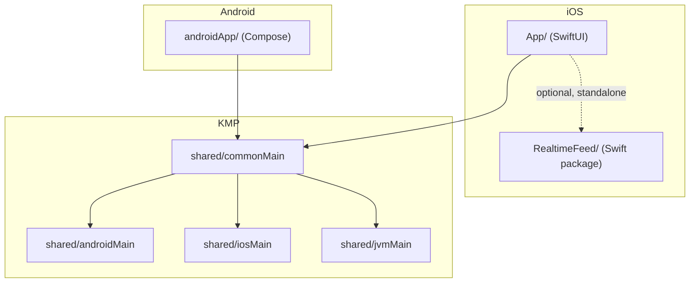

# Architecture

## Product goal

Prove that "shared business logic on Kotlin Multiplatform, native UI per platform" holds up for
a realtime-heavy, security-sensitive mobile app — not to ship a production wallet in a weekend.
Three verticals, each chosen because it maps to a specific engineering risk rather than a UI
checkbox:

1. **Realtime market data** (Binance) — reconnect, backpressure, sequence-gap recovery under a
   genuine high-message-rate feed.
2. **On-device credential custody** (Secure Enclave / Keystore) — hardware-backed signing,
   biometric gating, what is/isn't protected on a compromised device.
3. **A minimal read-only dApp flow** (WalletConnect + ERC-20 + NFT) — connecting an external
   wallet, reading on-chain state, and the shape of a transaction preview, on a testnet only.

## In scope

- Live Binance WebSocket feeds (trade stream, diff-depth order book) with reconnect and
  sequence-gap detection, shared between platforms.
- Hardware-backed signing key generation + biometric-gated signing, native per platform.
- Connecting an external wallet via WalletConnect (Reown AppKit) on Sepolia testnet.
- Reading ERC-20 balance/metadata and ERC-721 ownership/metadata via a public RPC endpoint —
  read-only, no private keys touch this app for on-chain assets.
- A transaction *preview* (recipient, amount, network, estimated gas) built client-side; actual
  signing and broadcast happens in the external wallet app, never in this app.

## Out of scope

- Mainnet. Nothing here writes to a network that costs real money.
- Any private key or seed phrase handling for on-chain assets — see the Wallet tab's own
  disclaimer for the *unrelated* local demo key it manages, which never signs anything on-chain.
- A general NFT/token indexer. Reading "all tokens a user owns" reliably requires an indexing
  service (e.g., an Etherscan-style API or a dedicated indexer); raw `ERC721Enumerable` /
  `balanceOf` calls don't reliably enumerate holdings across arbitrary contracts. This app reads
  specific, pre-configured contract + token-id pairs instead of trying to discover holdings.
- Transaction history, push notifications, token swaps — not attempted.

## Module boundary

```
RealtimeFeed/   Swift package. Independent of everything below — a second, non-KMP reference
                implementation of the same realtime design, kept for comparison.

shared/         KMP module (commonMain + androidMain + iosMain + jvmMain). All business logic
                that doesn't need a platform-only API lives here: realtime clients, RPC/ABI
                encoding, token/NFT repositories, reconnect/backoff/gap-detection policies.

App/            iOS app (SwiftUI). UI + thin adapters from shared's StateFlow/callback APIs to
                SwiftUI state. No domain logic.

androidApp/     Android app (Compose). UI + direct StateFlow consumption (no adapter needed —
                Kotlin talking to Kotlin). No domain logic.
```

**Dependency rule:** `shared/commonMain` never imports a platform-only API (no `UIKit`, no
`android.*` outside `androidMain`). Wallet-SDK types (Reown's AppKit classes) never appear in a
`commonMain` function signature — they're erased behind `WalletGateway` (see below) so the shared
layer can be tested with a fake and swapped to a different wallet SDK without touching call sites.

Security-sensitive platform primitives (Secure Enclave, Keystore/StrongBox, BiometricPrompt) are
*not* pulled into `shared/` even though they conceptually could be expressed behind an interface —
these APIs are deliberately non-portable, and forcing them through a shared abstraction would blur
exactly the guarantees they're meant to provide. Native, on purpose.

## Module map



## State flow

Realtime clients (`PriceFeedClient`, `OrderBookClient`) expose Kotlin `StateFlow`, which
conflates by construction — a slow collector always gets the latest value, never a backlog.
Android collects it directly (`collectAsState()`). Kotlin `StateFlow` doesn't bridge to Swift's
`AsyncSequence` without an extra library (SKIE / KMP-NativeCoroutines), so iOS goes through
`PriceFeedController`, a thin callback-based wrapper that exists purely for that bridging —
callbacks land on `Dispatchers.Main`, so Swift call sites can mutate UI state directly.

Wallet/RPC state (connection status, balances, NFT metadata) follows the same StateFlow pattern
once WalletConnect is wired in (see ADR-003).

## Errors

A single `AppError` sealed hierarchy, in `shared/commonMain`, distinguishes failure modes that
callers actually need to branch on:

```kotlin
sealed class AppError {
    data class Network(val cause: Throwable) : AppError()      // no connectivity / timeout
    data class Rpc(val code: Int, val message: String) : AppError()  // node returned an error
    data class InvalidData(val reason: String) : AppError()     // malformed ABI response, bad JSON
    data class WalletRejected(val reason: String) : AppError()  // user declined in external wallet
    data object Unauthenticated : AppError()                    // no active wallet session
}
```

RPC/ABI/repository code returns `Result<T, AppError>` rather than throwing, so UI layers get a
typed reason to render (retry button vs. "connect your wallet" vs. generic error), not a raw
exception message.

## Security assumptions

- The app never holds a private key for on-chain assets. WalletConnect sessions authorize an
  *external* wallet to sign; this app only ever sees public addresses, chain IDs, and signatures
  it didn't produce.
- Wallet address alone is not treated as proof of ownership — SIWE (Sign-In With Ethereum) requires
  a signature over a server-issued nonce before an address is considered "authenticated" for
  anything beyond read-only display.
- Session metadata shown in diagnostics (session topic, chain id, account) is masked/truncated,
  never logged verbatim.
- The Wallet tab's Secure Enclave/Keystore key is unrelated to any of the above — it's a local
  device-bound demo key for a different JD requirement (on-device credential handling), and it
  never touches chain state.

## Test strategy

Pure logic — reconnect timing, order-book sequence gap detection, token-refresh timing, ABI
encode/decode, decimals formatting, IPFS URI normalization — lives separated from I/O
specifically so it's unit-testable without a network or a clock. See `docs/testing.md` for the
full breakdown of what's tested where.

## CI strategy

Sequential jobs (`android-build → ios-build → lint → tests`) so a single status check tells a
reviewer "did this even build" before spending time on anything else. A real production pipeline
would parallelize these to cut feedback time — sequential only makes sense here because a
weekend-demo repository has one contributor and no need to save the extra few minutes. See
`docs/ci.md`.

## Decision backlog

Tracked as ADRs in `docs/adr/`:

- ADR-001 — why Kotlin Multiplatform over separate native implementations
- ADR-002 — why a repository boundary in front of RPC/wallet SDKs
- ADR-003 — why WalletConnect (external signer) instead of an in-app custodial key for on-chain
  assets
- ADR-004 — why MVVM / unidirectional state instead of something more elaborate

Open questions not yet resolved (revisit before any production step):

- Whether ERC-20/NFT repository code should move into its own KMP module (`shared:chain`) once it
  grows past a couple of screens — currently colocated with the realtime code in `shared/`.
- Whether `AppError` needs a `RateLimited` case once a real RPC provider with rate limits (rather
  than a public no-key endpoint) is in the picture.
